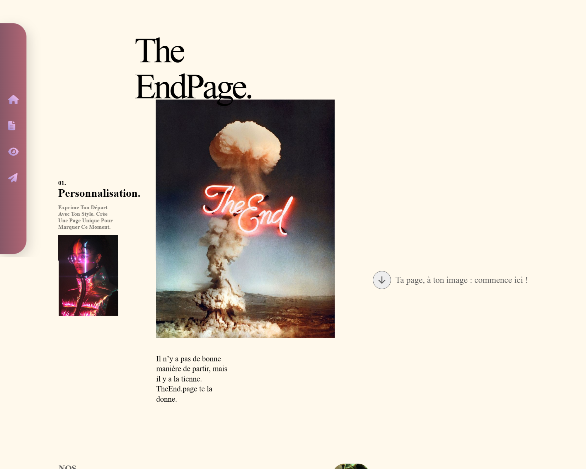

# 🏆 Webcup 2025
La Webcup est un hackathon de 24h organisé chaque année dans l’océan Indien. Les équipes doivent créer un site web original à partir d’un thème surprise, révélé au début de l’épreuve. L’objectif est de tester la créativité, la cohésion d’équipe et les compétences techniques des participants.

  

Le thème de cette édition était TheEnd.page, une idée originale de plateforme où toute personne qui quitte quelque chose — un travail, un projet, une équipe, une relation, un canal Discord, etc. — peut créer une page de départ personnalisée.
L’objectif : marquer la fin d’une aventure avec humour, émotion ou style, en laissant un message à ceux qui restent.

# Description du site 
TheEnd.Page est un site web unique  que nous avons conçu en tant qu’étudiants, qui offre un espace d’expression à toute personne ayant quitté une situation — qu’elle ait été joyeuse, douloureuse ou simplement marquante.

Dès la page d’accueil, on a essayé de poser une ambiance sobre et symbolique avec un design minimaliste. 

L’utilisateur est ensuite guidé vers le formulaire du "Rage quit", où il peut rédiger une publication personnalisée destinée à la situation qu’il a quittée. Une fois soumis, il a la possibilité d'accéder au CV inversé, une page originale où il peut exprimer ce qui lui manquera, ses ressentis, et même une dernière punchline.

Enfin, le parcours se conclut dans le Hall of Fame, une galerie des publications les plus appréciés par la communauté — une manière de célébrer les adieux les plus marquants.

🥈Notre travail a été récompensé par la 2ᵉ place à la Webcup régionale Maurice 2025🥈

  

# Équipe & Réalisation
Nous sommes Infinite Roots, une équipe d’étudiants en informatique, réunis pour relever le défi de la Webcup 2025. Durant 24h, nous avons donné le maximum pour concevoir TheEnd.page, un site fonctionnel, créatif et fidèle au thème.
Chacun a apporté ses compétences en design, développement front-end/back-end et gestion de projet. Cette expérience intense nous a permis de repousser nos limites, de collaborer efficacement et de transformer une idée originale en un site web plus ou moins complet.

  

# Membres de l'équipe : 
- **Mathieu** - [GitHub](https://github.com/Math-Baba)
- **Amy** - [GitHub](https://github.com/AmysGith)
- **Junior** - [GitHub](https://github.com/kkk083)
- **Bryan RASOLONDRAIBE** 
